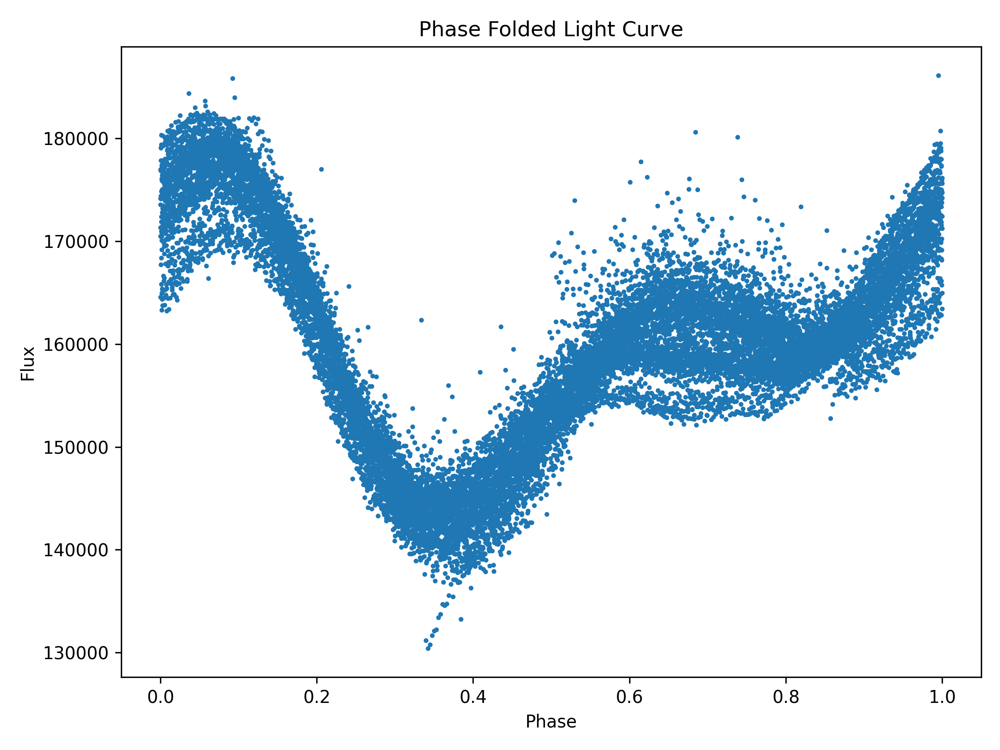

# Phase Folding Tool

Astronomy project for phase folding and visualization of stellar light curves using Python.

## Features

- Load TESS light curves
- Apply phase folding
- Visualize phased stellar signals
- Save phase diagrams
- Explore stellar variability

## Dataset

Mission: **TESS (Transiting Exoplanet Survey Satellite)**

Target used:

**AB Dor**

Approximate period:

**0.514 days**

## Output Preview

## Tools Used

- Python
- Lightkurve
- Astropy
- NumPy
- Matplotlib

## Scientific Context

Phase folding is commonly used in:

- Stellar rotation studies
- Variable star analysis
- Exoplanet transit detection
- Period analysis
- Time-series astronomy workflows

